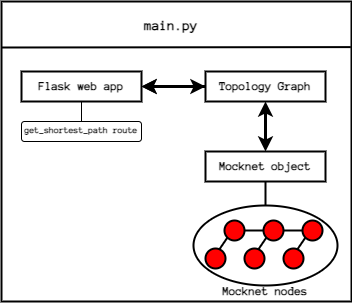

# Tarefa 03 do onboarding

Objetivo: Implementar uma API "RESTful" com Flask para interagir com o grafo da topologia.

## Introdução

Nesta tarefa, deverá ser implementada uma API para interagir com uma topologia de rede Mocknet.
Para a execução da tarefa, será preciso antes:
- Conhecer o que é uma API web
- Conhecer o web framework Flask
- Conseguir criar uma app web simples com Flask (há diversos tutoriais online, inclusive a própria documentação do Flask, que ensinam isso)
- trabalhar com json

Feito isso, a task consistirá na implementação de uma web API que faça a interface com o grafo da topologia Mocknet.
Inicialmente, a app Flask deverá ter uma rota compatível com o método HTTP GET que receba como parâmetros (via HTTP) os nomes de dois nós da topologia e que retorne o caminho mais curto entre esses dois nós (conforme implementado na task 02).
Caso um dos nós não seja encontrado, a API deverá retornar um erro HTTP 404 Not Found.

#### OBS: Não use variavel na URL, procure por `'http get parameters'`, use os nomes 'source' como parametro de origem e 'target' de destino.  

Nessa task, deverão ser entregues **quatro** módulos Python.
O primeiro módulo deve consistir na implementação da classe Topology, conforme a task anterior.
O segundo módulo deve conter a web app Flask desenvolvida nesta task.
O terceiro módulo será a implementação de SimpleSwitch feita na task 01.
Por fim, o quarto módulo deverá ter um script que deve:
- Criar dispositivos na rede Mocknet em uma topologia linear (no mínimo 3 switches) 
- Instanciar as classes Topology, Mocknet e Flask (na ordem correta para que o grafo da topologia adicione os dispositivos)
- Iniciar a API com o `app.run()`

Por fim, a entrega deverá ter um script shell (bash) que utilize o comando `curl` para consultar a API pelo método HTTP GET para obter o melhor caminho entre dois nós (a fim de testar o funcionamento da API).

## Arquitetura do sistema

A fim de esclarecimento, a arquitetura do sistema está descrita conforme a figura abaixo.

## Lista de tarefas

Para facilitar, a seguir está descrita uma lista de componentes do sistema e suas propriedades que deverão ser implentadas:

- Módulo do SimpleLearningSwitch
  - Essa é a oportunidade de correção de quaisquer irregularidades no código do learning switch
- Módulo da topologia Mocknet
  - Deverá se chamar `topology.py`
  - Deve conter a classe `Topology` feita na task 02
- Módulo da aplicação web (Flask API)
  - Deverá se chamar `app.py`
  - O objeto `app` (Flask) deverá ter uma rota `get_shortest_path`
  - Essa rota deverá receber como parâmetro dois nomes de nós da topologia
  - A app deve então verificar se esses nós existem
  - Se ambos existirem, retornar o menor caminho entre eles
  - É importante serializar todos os retornos da API com JSON
- Módulo principal
  - Deverá se chamar `main.py`
  - Instanciar a topologia Mocknet e criar os hosts, switches e links
    - Utilizar topologia linear com 3 switches conectados em linha
    - Pelo menos 3 hosts
  - Instanciar o grafo da topologia (`Topology`) e adicionar o objeto Mocknet ao grafo
  - Instanciar a app Flask e associar o objeto da topologia de modo que a app consiga acessar o grafo
- Script para teste
  - Deverá se chamar `test.sh`
  - Deve conter um ou mais comandos utilizando o software `curl` que façam requisições HTTP para a API como forma de teste
  - As requisições devem consultar a API por caminhos mais curtos no grafo da topologia 
  
  
### Entrega: ate 22/04/2024. 
- test.sh
- app.py
- topology.py
- main.py

 
