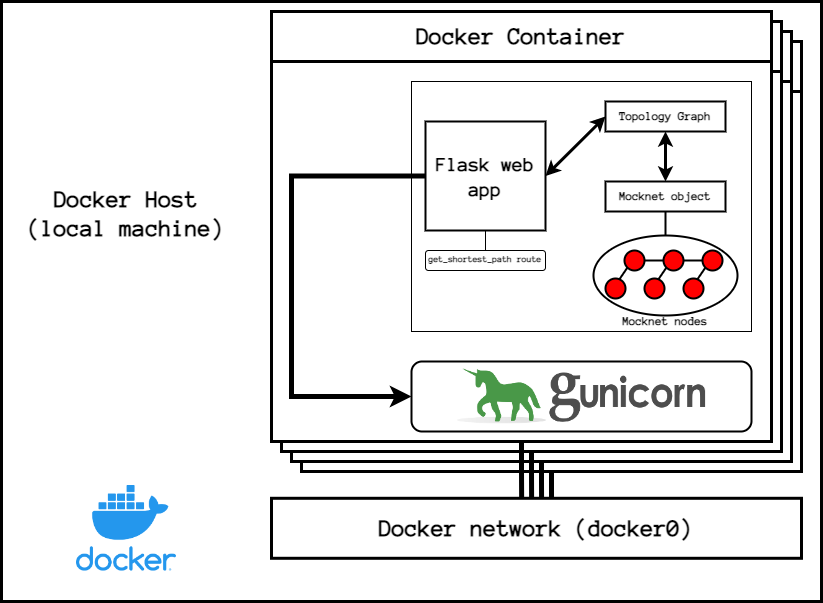

# Tarefa 04 do onboarding

Objetivo: Entregar a app Flask em um container Docker.

## Introdução

Nesta etapa do Onboarding, será feita a configuração de uma imagem [Docker](https://docs.docker.com) para o deployment da aplicação desenvolvida nas tasks anteriores.
Além disso, deverá ser acrescentada à API três novos endpoints:
- `/switches`: deve retornar uma lista (JSON) com os nomes de todos os switches da topologia
- `/hosts`: deve retornar uma lista (JSON) com os nomes de todos os hosts da topologia
- `/links`: deve retornar uma lista (JSON) com todos os links da topologia


## Imagem Docker

Nessa task, o arquivo denominado `Dockerfile` define os comandos necessários para configurar as dependências da sua aplicação e instalá-la no container.
O Dockerfile também deverá conter uma diretiva `EXPOSE`, que indique a porta TCP que dará acesso à web API.
Além disso, a diretiva `RUN` indicará o comando a ser executado no momento em que o container é iniciado (pelo `docker run`).
A documentação inicial sobre Docker pode ser encontrada [aqui](https://docs.docker.com/get-started/overview/), e a documentação sobre a sintaxe do arquivo Dockerfile [aqui](https://docs.docker.com/engine/reference/builder/).

Nesse caso, ao invés de utilizar o `app.run` do Flask, será necessário instalar e executar o server [gunicorn](https://gunicorn.org/). Há uma documentação oficial do Flask de integração com o gunicorn disponível em <https://flask.palletsprojects.com/en/2.1.x/deploying/gunicorn/>.

## Arquitetura do sistema

O provisionamento da aplicação em um container Docker segue a seguinte arquitetura:



> Obs.: O "docker host" nada mais é do que o computador em que o docker está sendo executado. Os containers são criados e executados no docker host.


## Script de Teste

O objetivo desta Task 4 é empacotar a aplicação com o Docker sendo o `Gunicorn` o nosso "ENTRYPOINT/CMD", No total pelo menos 3 aplicações simultaneamente, então será no mínimo um script.sh 
Exemplo:
```bash
#!/bin/bash
docker run ... ... ...    --nome aplicação1 ... ... ... port 5001
docker run ... ... ...    --nome aplicação2 ... ... ... port 5002
docker run ... ... ...    --nome aplicação3 ... ... ... port 5003
curl  [ teste da aplicação 1]
...
curl  [ teste da aplicação 2]
...
curl  [ teste da aplicação 3]
...
docker stop ....
docker stop ...
docker stop ...
```

## Pontos de Avaliação

- Para essa Task a avaliação sera as correções pendentes e o Script no padrao citado acima e apresentação, lembrando que o Gunicorn deve ser iniciado com o objeto/variavel `app` do `main.py`.


## Material de Apoio

- [Curso de Docker - Linuxtips (3H - Com Certificado)](https://www.linuxtips.io/course/docker-essentials)
- [Live de Docker - Fabricio Veronez](https://www.youtube.com/watch?v=v6JMEH5bgOo&pp=ygUXZmFicmljaW8gdmVyb25leiBkb2NrZXI%3D)
- [Live de Docker - Full cycle (Wesley willians) ](https://www.youtube.com/watch?v=K1V0FVDdluY&pp=ygURZnVsbCBjaWNseSBkb2NrZXI%3D)
- [Live de Python #101 - WSGI e Gunicorn ](https://www.youtube.com/watch?v=J354T4gth0s)


## Arquivos para Entrega
- main.py
- topology.py
- app.py
- Script de execução dos teste
- Dockerfile (usado para criar a imagem)
- Comandos usados para buildar a imagem (pode ser um .txt ou realizar o build no propio .sh de teste)

